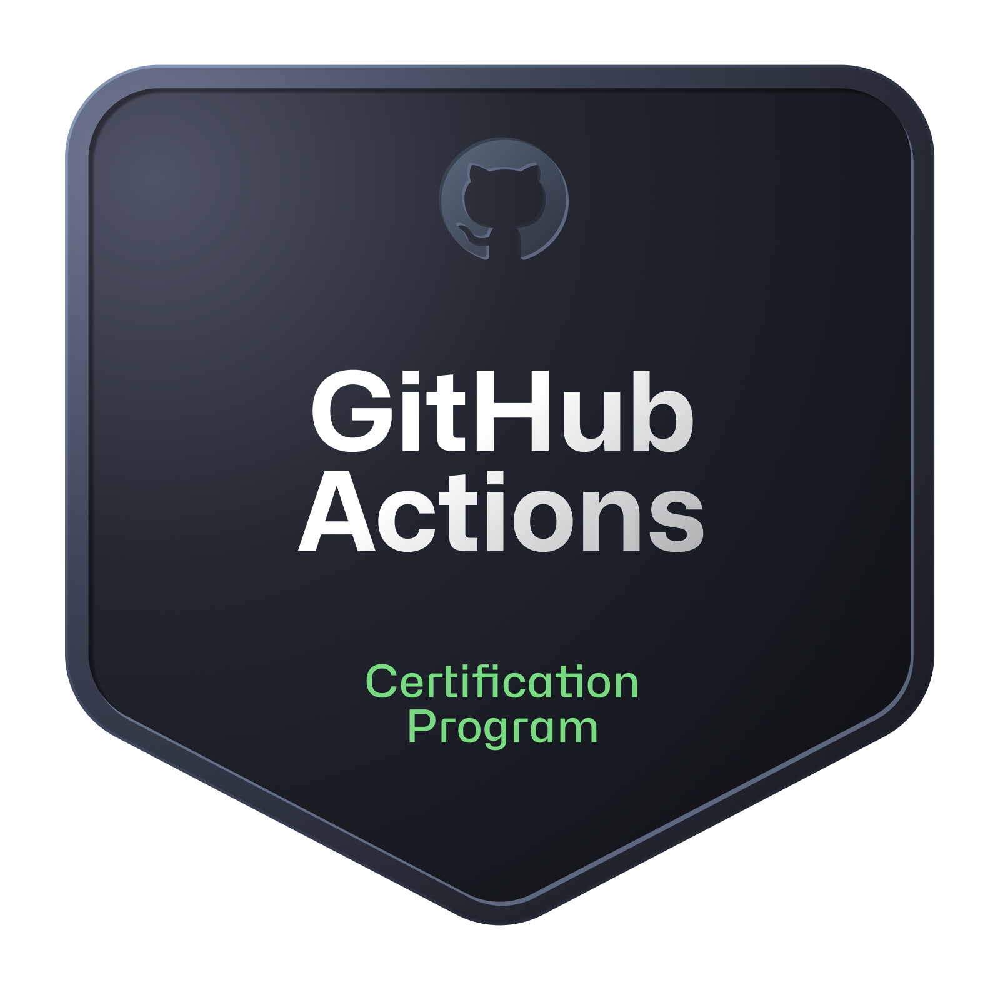
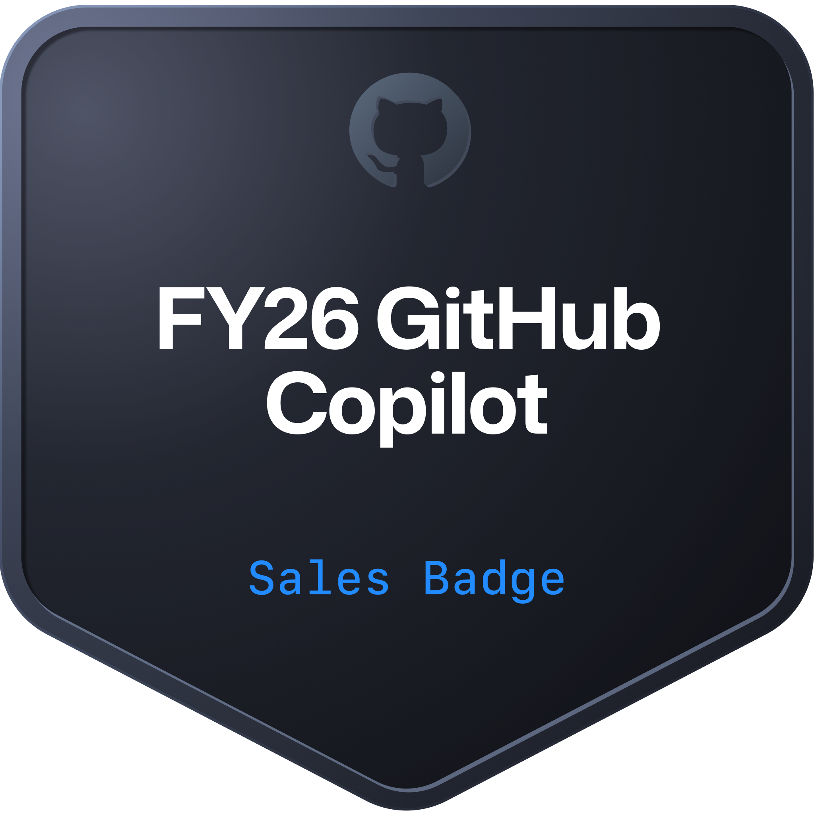
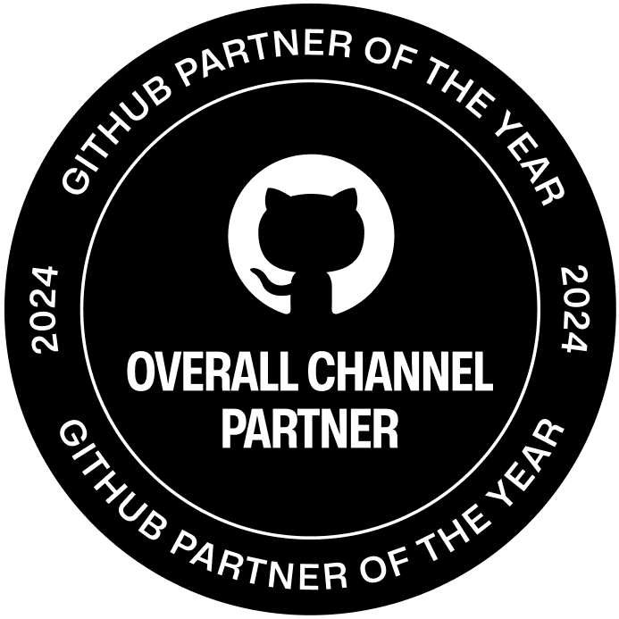
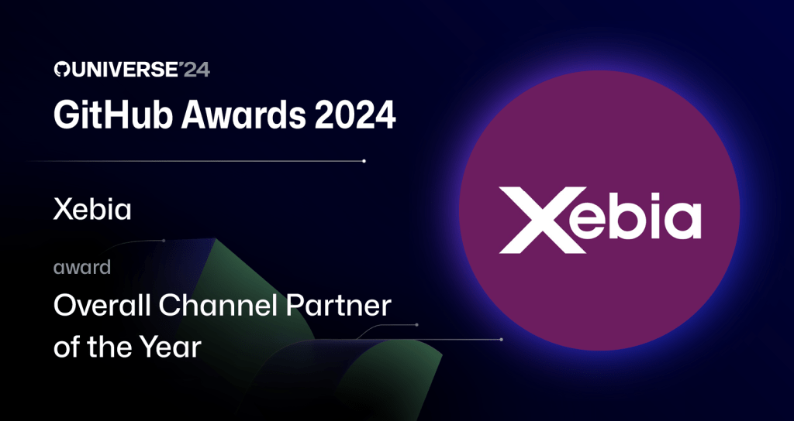
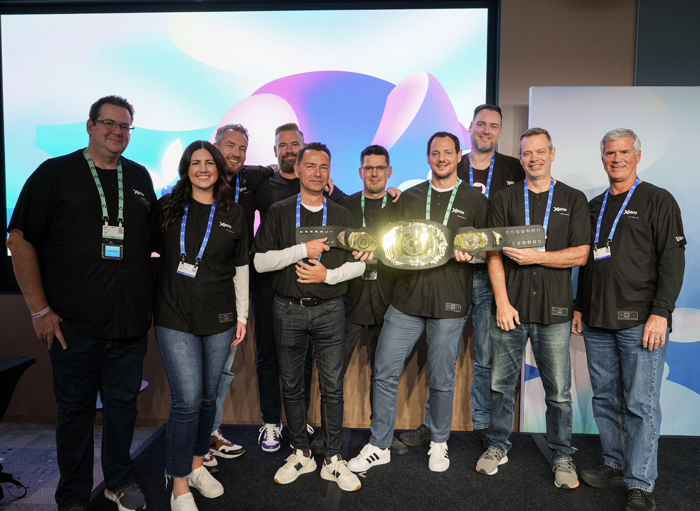
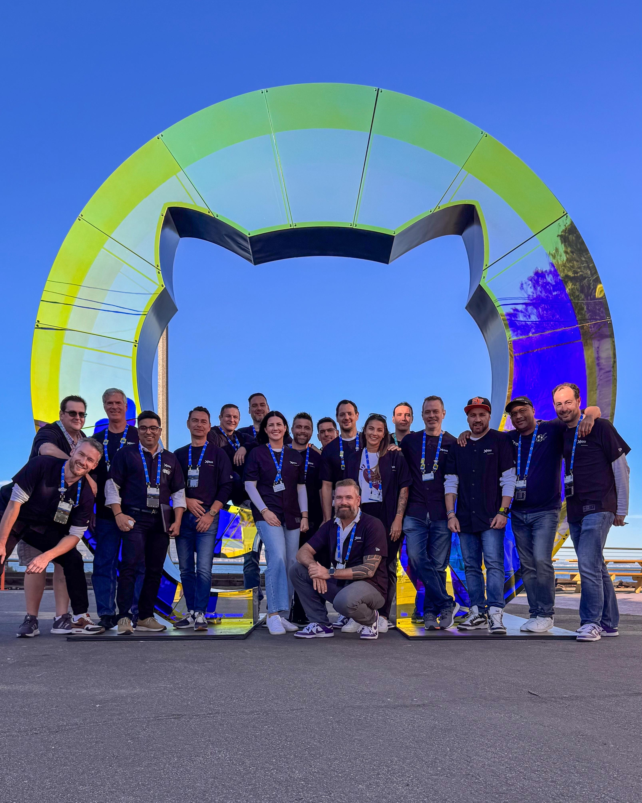

# 👋 Hi, I'm Rich Schwarz

## 🚀 About Me

**DevOps Architect @ Xebia | GitHub Copilot Enablement | DevOps Transformation | Enterprise Platform Migrations**

DevOps architect with 30+ years of experience helping large enterprises transform how they build and ship software. I specialize in GitHub platform adoption — from Copilot enablement and prompt engineering to large-scale migrations from Bitbucket, GitLab, AzDO, and Jenkins. I've spent my career at the intersection of people, process, and tooling, driving measurable change across financial services, government, and global enterprises.

### 🎯 Key Areas of Expertise

- GitHub Copilot enablement, metrics, and prompt engineering
- DevOps transformation and platform migrations (Bitbucket, GitLab, AzDO, Jenkins → GitHub)
- Solution Architecture for GitHub transformation projects
- CI/CD, GitHub Actions, and Infrastructure as Code
- DevOps assessments and enterprise-scale tool deployments
- Application Lifecycle Management (ALM) and development tooling

### 💡 Profile

Passionate about making developers more effective. Whether I'm leading a GitHub Copilot rollout, architecting a migration from a legacy platform, or coaching teams on modern DevOps practices, my focus is always on delivering real, lasting change — not just installing tools. With a background spanning both deep technical architecture and executive leadership, I connect technology decisions to business outcomes.

---

## 🏆 Certifications

  
  
  
  
  
  
  
  
  
  
  
  
  
  
  
  

## 🏅 GitHub Partner of the Year Awards

Part of Xebia's two-time GitHub Partner Award-winning team, with consecutive wins in [2024](https://github.blog/news-insights/company-news/celebrating-the-github-awards-2024-recipients/) and [2025](https://github.blog/news-insights/company-news/announcing-the-2025-github-partner-award-winners/).

  
  
  

- **2025: Strategic Services and Channel Partner of the Year**
  - Recognized by GitHub for driving innovation, collaboration, and impact across the developer ecosystem.
  - Reflected the work we do helping enterprise clients adopt GitHub Copilot, modernize developer platforms, and execute complex migrations to GitHub.

  

    
    
    
  

- **2024: Overall Channel Partner of the Year**
  - Recognized for excellence across platform utilization, AI integration, security implementation, customer satisfaction, and overall business impact.
  - GitHub highlighted Xebia's strengths in application development, cloud deployment services, and GitHub migration and integration.

---

## 💼 Experience Highlights

### Principal Consultant/DevOps Architect – Xebia (2023 – Present)
Leading GitHub platform transformation engagements for enterprise clients, with a focus on AI-assisted development and migrations from legacy DevOps toolchains.

**Platform Adoption & Enablement**
- Lead GitHub Copilot enablement programs across technical and organizational dimensions—from capability metrics and governance to prompt engineering best practices, ensuring developers unlock AI productivity gains responsibly
- Build adoption strategies that address the human-side of transformation: organizational readiness, skills reskilling, and cultural change management alongside technical enablement

**Pipeline & CI/CD Migration Complexity**
- Lead migration initiatives from Bitbucket, GitLab, AzDO, and Jenkins to GitHub, navigating the technical and architectural complexities of legacy CI/CD systems
- Address primary migration challenges: decoupling tightly-integrated workflows, re-architecting self-hosted runner infrastructure, managing secret rotation at scale, and refactoring multi-platform build logic into GitHub Actions patterns
- Help teams transition from imperative pipeline scripts to declarative workflows while preserving reliability and visibility

**Well-Architected Transformation**
- Design end-to-end solution architecture for GitHub transformation programs using GitHub Well-Architected Framework principles—achieving security, reliability, performance, and cost optimization from day one
- Accelerate time-to-value by architecting foundational governance, branching strategies, and platform standards that enable hundreds of teams to operate efficiently without central bottlenecks
---
### DevOps Executive – Li atrio (2022 – 2023)
Helped complex organizations implement the GitHub platform and drive digital transformation through enterprise DevOps and cloud-native delivery.
- Guided large enterprises through systemic DevOps transformation using GitHub
- Enabled organizations to deliver value faster and more safely at scale
---
### DevOps Senior Manager – Accenture (1995 – 2021)
A 27-year career spanning hands-on technical architecture to executive leadership across global enterprises and government.

**DevOps Practice (2011 – 2021)**
- DevOps Solution & Technical Architecture
- DevOps Assessments and Transformation Journeys
- CI/CD for Salesforce Implementations
- Private Cloud Operations Management

**Application Lifecycle Management Deployment Lead (2005 – 2011)**
- Large-scale Development / ALM Tool & Process Deployments
- Development Tools Solution Architect

**Technical / Architect Roles (1995 – 2004)**
- Model Driven Architecture (MDA) and Custom Component Architecture
- Program Management and Development Management
- Object Oriented Development & Architecture

---

## 🎓 Education
- **Bachelor of Science, Information Systems (1991 – 1995)** — University of Colorado Boulder

---

## 📫 How to Find Me

- 💼 LinkedIn: [rich-schwarz](https://www.linkedin.com/in/rich-schwarz/)
- 🏆 Credly: [rich-schwarz](https://www.credly.com/users/rich-schwarz/badges)
- 🐱 GitHub: [@teamschwarz](https://github.com/teamschwarz)

---

*Profile last updated: March 2026*
